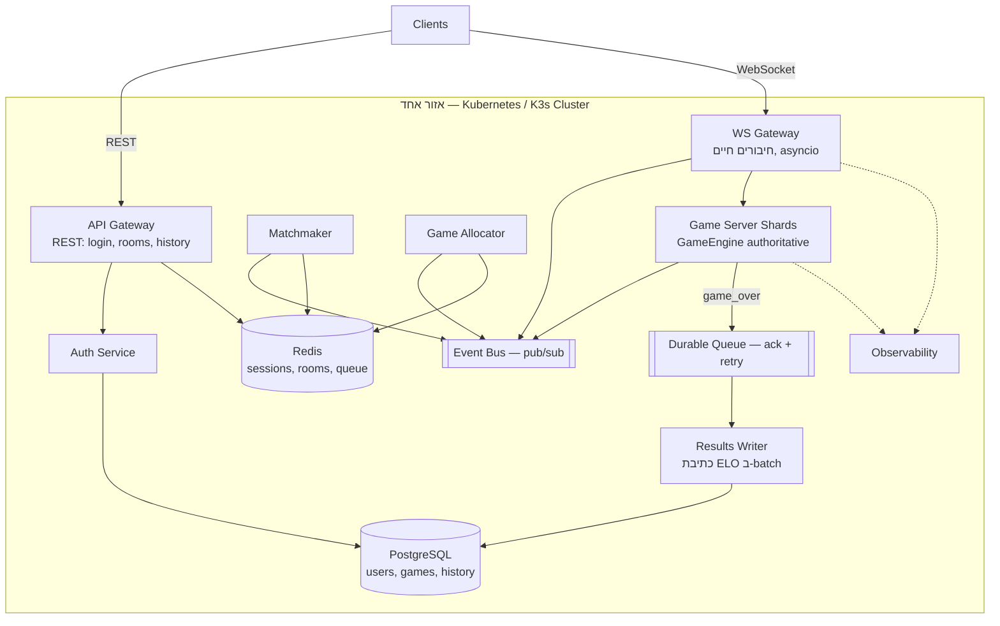

<div dir="rtl">

# Server Design — Kung Fu Chess בקנה מידה גדול

מסמך תכנון לצד השרת, במעבר משרת יחיד (התהליך הנוכחי ב‑`server/`) למערכת
שתומכת ב‑100 מיליון משתמשים רשומים ו‑10 מיליון משחקים במקביל.

המסמך בנוי כך: קודם **מספרים**, מהם נגזרים **רכיבים**, ומהרכיבים נגזרת
**התנהגות בכשל**. כל החלטה כאן נגזרת מהחישוב בסעיף 2 — אם ההנחות משתנות,
המסקנות משתנות איתן.

---

## 1. הנחות

| # | הנחה | ערך |
|---|------|-----|
| 1 | משתמשים רשומים | 100,000,000 |
| 2 | שחקנים פעילים במקביל | 10,000,000 |
| 3 | קצב צעדים לשחקן | צעד כל 2 שניות |
| 4 | אורך משחק | 30–90 שניות (ממוצע: 60) |
| 5 | שחקנים למשחק | 2 (+ צופים בחדרים) |
| 6 | גודל הודעת `move` על החוט | ~200B (\u200F~100B JSON + WS/TCP headers) |

הנחות 1–4 ניתנו בדרישות. 5–6 נגזרות מהפרוטוקול הקיים ב‑`protocol/messages.py`.

---

## 2. חשבון עומס

זה הסעיף שמכתיב את כל השאר.

### 2.1 תעבורת רשת

<div dir="ltr">

```
הודעות נכנסות   = 10,000,000 שחקנים ÷ 2 שניות  = 5,000,000 הודעות/שנייה
רוחב פס נכנס    = 5,000,000 × 200B             ≈ 1 GB/s  ≈ 8 Gbit/s
הודעות יוצאות   = כל צעד משודר ל‑2 שחקנים      = 10,000,000 הודעות/שנייה
רוחב פס יוצא    ≈ 2.5 GB/s                     ≈ 20 Gbit/s
```

</div>

**האם זה הרבה?** לשרת בודד — בלתי אפשרי. לרשת אינטרנט — לא. 20 Gbit/s הוא
סדר גודל של שירות וידאו בינוני, ומתחלק על פני מאות מכונות ומספר אזורים.
המסקנה היא שהבעיה אינה רוחב הפס אלא **מספר החיבורים הפתוחים** ו‑**מספר
ההודעות לשנייה**, ואלה מתחלקים יפה אופקית.

> ⚠️ החישוב לעיל מניח שידור **דלתא** (אירוע הצעד בלבד). המימוש הנוכחי משדר
> את **הלוח המלא** בכל צעד — ראו סעיף 8.1. בשידור לוח מלא (~1KB) המספר
> קופץ פי 5 לפחות, ואם משדרים כל tick (10Hz כמו היום) הוא קופץ פי 50.

### 2.2 קצב משחקים — המספר המפתיע

זה החישוב שהכי משנה את התכנון, והוא לא ברור מאליו:

<div dir="ltr">

```
משחקים במקביל       = 10,000,000 ÷ 2                 = 5,000,000 משחקים
משחקים מסתיימים/שנייה = 5,000,000 ÷ 60 שניות          ≈ 83,000 משחקים/שנייה
בקשות matchmaking/שנייה ≈ 83,000 × 2 שחקנים           ≈ 166,000 בקשות/שנייה
כתיבות ELO/שנייה     = 83,000 × 2 שחקנים              ≈ 166,000 כתיבות/שנייה
```

</div>

**המסקנה:** אורך המשחק הקצר (30–90 שניות) הופך את המערכת ל**מערכת עתירת
כתיבות (write-heavy)**, לא לקריאות. 100 מיליון משתמשים זה נפח אחסון קטן
(סעיף 4.2), אבל 166,000 כתיבות בשנייה זה מעבר למה שמופע PostgreSQL יחיד
עושה. זו הבעיה האמיתית של ה‑DB — לא מספר המשתמשים.

הפתרון: כתיבות ELO **לא** נכתבות מהנתיב החם. הן נזרקות לתור עמיד ונכתבות
ב‑batch על ידי שירות ייעודי (סעיף 3, `Results Writer`).

**מה ה‑batching פותר ומה לא.** איגוד של 1,000 עדכונים לטרנזקציה **אינו
מקטין את כמות הדאטה הנכתבת** — הוא מקטין את מספר הטרנזקציות:

| | ללא batching | עם batching |
|---|---|---|
| עדכוני שורות/שנייה | 166,000 | **166,000** (ללא שינוי) |
| טרנזקציות/שנייה | 166,000 | **166** |
| פעולות fsync/שנייה | 166,000 | **166** |

מה שנחסך הוא **המס הקבוע לכל טרנזקציה** — בעיקר ה‑fsync ל‑WAL, שבו
PostgreSQL ממתין פיזית לדיסק לפני שהוא מאשר את הטרנזקציה. 166,000 פעולות
fsync בשנייה אינן אפשריות פיזית; 166 הן זניחות.

**מה שנשאר פתוח:** 166,000 עדכוני שורות בשנייה עדיין גבוליים למופע יחיד
(סדר גודל ריאלי: 50–100 אלף). ההמשך בסעיף 4.3.

### 2.3 גודל הצי (הערכה)

| רכיב | קיבולת לפוד (הערכה) | פודים דרושים |
|------|---------------------|--------------|
| WS Gateway | ~20,000 חיבורים פתוחים | ~500 |
| Game Server Shard | ~2,000 משחקים מקבילים | ~2,500 |
| Matchmaker | ~10,000 בקשות/שנייה | ~20 |
| API Gateway | לפי קצב לוגינים, לא לפי משחקים | ~50 |

המספרים הם הערכות לצורך סדר גודל ומחייבים אימות ב‑load test (סעיף 3,
`Observability`). הקיבולת לפוד תלויה ישירות ב‑asyncio ובכך שאין thread
לכל לקוח — מודל שהקוד הנוכחי כבר עובד לפיו.

---

## 3. ארכיטקטורה

<div dir="ltr">



</div>

### 3.1 טבלת רכיבים

| רכיב | אחריות | סטייט | סקיילינג |
|------|--------|-------|----------|
| **API Gateway** | כל מה שאינו זמן אמת: login, יצירת/רשימת חדרים, היסטוריה | חסר סטייט | HPA לפי CPU |
| **WS Gateway** | מחזיק את החיבור החי מול הלקוח, מנתב הודעות אל השארד הנכון ובחזרה | מיפוי חיבור→שארד (בזיכרון + Redis) | HPA לפי מספר חיבורים |
| **Auth Service** | אימות סיסמה, הנפקת session token | חסר סטייט | HPA |
| **Matchmaker** | מוצא זוג שחקנים בטווח ELO \u200F±100 | תור ב‑Redis (sorted set לפי ELO) | מחולק לפי מדף ELO ואזור |
| **Game Allocator** | מחליט **על איזה שארד** ירוץ כל משחק | מפת עומס שארדים ב‑Redis | מופעים ספורים, בחירת מנהיג |
| **Game Server Shard** | מריץ את המשחקים עצמם. `GameEngine` הוא ה‑single source of truth | משחקים חיים בזיכרון (ארעי) | הרוב המכריע של הצי |
| **Results Writer** | צורך `game_over` מהתור העמיד, מחשב ELO, כותב ב‑batch | חסר סטייט (ה‑offset בתור) | לפי קצב אירועים |
| **Observability** | logs, metrics, traces, health checks, load tests | — | — |

### 3.2 מדוע API Gateway ו‑WS Gateway מופרדים

לא בגלל "נקיון" אלא כי הם נחנקים ממשאבים שונים: REST חסום CPU, בעל שיאי
עומס קצרים וניתן לקישינג; WebSocket הוא חיבורים ארוכי‑חיים החסומים בזיכרון
ובמספר file descriptors. אם שניהם באותו פוד, גל מתחברים מאלץ סקיילינג של
הלוגין, ולהפך.

### 3.3 Game Allocator — למה זה רכיב נפרד

זו התשובה לדרישה "כולם יכולים לשחק עם כולם". לא צריך שכל השחקנים יהיו על
אותו שרת — צריך רק ששני שחקני **אותו משחק** יגיעו לאותו שארד:

1. `Matchmaker` מחליט **מי נגד מי** (או `Rooms API` — מי הצטרף לאיזה חדר).
2. `Game Allocator` מחליט **איפה זה רץ**, לפי עומס, קיבולת וקרבה גאוגרפית.
3. שני ה‑WS Gateways מנתבים את שני החיבורים לאותו שארד.

ההפרדה בין "מי" ל"איפה" היא מה שמאפשר לצי לגדול בלי הגבלה על מי משחק נגד מי.

### 3.4 שני אפיקי תקשורת, לא אחד

התקשורת בין השירותים ממלאת **שני תפקידים שונים**, עם דרישות מנוגדות. זיהוי
ההבדל חשוב יותר מבחירת המוצר:

| | אפיק אירועים (pub/sub) | תור עמיד (work queue) |
|---|---|---|
| דוגמה | עומס שארדים, health, presence | `game_over` → כתיבת ELO |
| הדרישה | latency מינימלי | **אסור לאבד הודעה** |
| אובדן הודעה | נסבל — ראו למטה | בלתי קביל — דירוג נעלם |
| מסירה | פעם אחת, למי שמקשיב עכשיו | ack + מסירה חוזרת עד הצלחה |
| מימוש אפשרי | NATS core, Redis Pub/Sub | NATS JetStream, Kafka, RabbitMQ |

**למה זו לא קטנוניות:** pub/sub רגיל אינו שומר הודעות. אם אף מנוי לא מקשיב
באותו רגע — ההודעה פשוט נעלמת. לתוצאת משחק ולדירוג זה אובדן דאטה, ולכן הן
**חייבות** לעבור בתור עמיד; זה גם מה שמצריך את ה‑idempotency בסעיף 5.5.

**מתי אובדן באמת נסבל — ומתי לא.** התשובה "יגיע עדכון הבא" תקפה רק
לטלמטריה **מחזורית**, שבה כל הודעה מחליפה את קודמתה: דיווח עומס של שארד,
health, מספר מחוברים. שם ההודעה הבאה תגיע בעוד שנייה ותישא את המצב העדכני,
כך שאובדן מתקן את עצמו.

לאירוע **חד־פעמי** הטיעון אינו תקף. שיבוץ משחק (Matchmaker → Gateways) הוא
המקרה הבולט: אם ההודעה נעלמת, שני השחקנים ממתינים ללא תשובה ואין "הודעה
הבאה". הוא צריך אפוא תור עמיד, או timeout מפורש שמחזיר את השחקנים לתור.

**מה שאינו עובר כאן כלל:** עדכוני הלוח אל הלקוח. הם נוסעים על ה‑WebSocket
עצמו (`Client ⇄ WS Gateway ⇄ Shard`), כלומר על TCP — שמבטיח מסירה וסדר, או
שובר את החיבור. אין שם אובדן שקט, ולכן זו אינה שאלה של pub/sub. הטיפול
באובדן בערוץ הזה מתואר בסעיף 8.1.

**הקשר לקוד הקיים:** `kungfu_chess/bus/event_bus.py` הוא publish/subscribe
בתוך תהליך אחד — כלומר בדיוק אפיק האירועים, רק שהמנויים יושבים באותו
תהליך. אותו רעיון של `subscribe(event_type, handler)`, ברמת קנה מידה אחת
מעלה. מה שאין בו היום כלל הוא הצד השני, התור העמיד.

---

## 4. אחסון ותקשורת

### 4.1 מדוע SQLite לא מתאים

לא מטעמי גודל, אלא משלוש סיבות מבניות:

1. **הוא קובץ, לא שרת.** `server/db.py:14` מחזיק `sqlite3.Connection` יחיד
   **בתוך התהליך**. ברגע שיש יותר מקונטיינר אחד, אין להם דרך לראות את אותו
   קובץ — קונטיינרים לא חולקים מערכת קבצים.
2. **כותב יחיד.** SQLite נועל את כל בסיס הנתונים לכתיבה. מול הדרישה של
   ~166,000 כתיבות/שנייה (סעיף 2.2), זה חוסם מיידית.
3. **אין רפליקציה, failover או שארדינג.** נפילת הדיסק = אובדן כל המשתמשים.

### 4.2 מה במקום — פיצול לפי סוג הדאטה

**אחסון** — שלושה סוגי דאטה, שלוש טכנולוגיות:

| דאטה | טכנולוגיה | נימוק |
|------|-----------|-------|
| users, passwords, ELO, תוצאות | **PostgreSQL** (primary + read replicas + pgBouncer) | דורש עמידות ועקביות. 100M שורות × ~200B ≈ **20GB** — נכנס בנוחות למכונה אחת, ולכן שארדינג **לנפח** אינו נדרש (ראו 4.3) |
| sessions, חדרים פעילים, תור matchmaking, reconnect | **Redis** (Cluster + replicas) | ארעי, נגיש במיליוני פעולות/שנייה, מחיקה אוטומטית ב‑TTL |
| ארכיון היסטוריה | **append-only** לתור ומשם ל‑object storage | נכתב פעם אחת, כמעט לא נקרא, זול לג'יגה |

**תקשורת** — אפיק האירועים והתור העמיד (סעיף 3.4) מופיעים כאן לשלמות
התמונה אבל **אינם בסיסי נתונים**: הם מעבירים הודעות ולא משמשים כמקור אמת.

ההערה החשובה: 20GB זה **קטן**. האינטואיציה ש"100 מיליון משתמשים ⇐ צריך
שארדינג" שגויה כאן. מה שמחייב תכנון מיוחד הוא קצב הכתיבה, לא הנפח.

### 4.3 שארדינג לתפוקה, לא לנפח

ההבחנה חשובה: 20GB נכנסים למכונה אחת, אבל 166,000 עדכוני שורות בשנייה
(סעיף 2.2) גבוליים למופע יחיד. ה‑batching של `Results Writer` מטפל בקצב
הטרנזקציות ולא בקצב השורות, ולכן ייתכן שיידרש צעד נוסף. שלוש דרכים, לפי
סדר עלות:

| פתרון | מה זה נותן | המחיר |
|-------|------------|-------|
| `COPY` לטבלה זמנית + `UPDATE ... FROM` יחיד | זול משמעותית לשורה מאשר 1,000 פקודות נפרדות | ללא |
| Write-behind: הדירוג ב‑Redis, נכתב כל N משחקים | מקטין את **מספר השורות** ולא רק את הטרנזקציות | נפילת Redis מאבדת עדכוני דירוג אחרונים |
| שארדינג לפי `hash(username)` על 4 primaries | ~42K עדכונים/שנייה לכל אחד | תפעול מורכב יותר |

**ההחלטה:** להתחיל בשתי הראשונות, ולשמור את השארדינג למקרה שמדידה בפועל
תראה שאינן מספיקות. שארדינג כאן הוא **לתפוקת כתיבה**, לא לנפח אחסון —
הבחנה ששווה לומר במפורש, כי היא הפוכה מהאינטואיציה הרגילה.

### 4.4 כמה היסטוריה שומרים — החלטה מוצרית

השורה האחרונה בטבלה תלויה בהחלטה שאינה טכנית, וכדאי לקבל אותה במפורש:

| מדיניות | נפח לחודש | איפה זה יושב |
|---------|-----------|--------------|
| כל צעד, לנצח | 5M צעדים/שנייה ≈ **650TB** | חובה object storage |
| כל תוצאת משחק, לנצח | 83K/שנייה ≈ **42TB**, ~216 מיליארד שורות | חובה object storage |
| 20 המשחקים האחרונים לשחקן | חסום, ~100M × 20 שורות | **PostgreSQL מספיק** |

**ההחלטה:** לשמור ב‑PostgreSQL היסטוריה חסומה לתצוגה בפרופיל השחקן, ולזרום
את המלא לארכיון. כך אין צמיחה בלתי מוגבלת בבסיס הנתונים התפעולי.

---

## 5. זרימות מרכזיות

### 5.1 Login
`Client → API Gateway (REST) → Auth Service → PostgreSQL` → מוחזר session
token, שנשמר ב‑Redis. ההתחברות ב‑WebSocket מציגה את הטוקן במקום סיסמה.

### 5.2 Play (matchmaking)
1. הלקוח שולח `play` דרך ה‑WS Gateway.
2. `Matchmaker` מכניס אותו ל‑sorted set ב‑Redis לפי ELO ומחפש
   `ZRANGEBYSCORE elo-100 elo+100`. אין התאמה תוך 60 שניות → הודעת כישלון
   (הלוגיקה הקיימת ב‑`server/matchmaking.py`, רק עם מצב משותף).
3. נמצאה התאמה → `Game Allocator` בוחר שארד ומחזיר את כתובתו.
4. שני ה‑WS Gateways מקבלים על אפיק האירועים את השיבוץ ומחברים את שני
   הלקוחות לשארד.
5. השארד יוצר `Match` ומתחיל את ה‑tick loop.

### 5.3 Room
`room create` → `Rooms API` מייצר מזהה ורושם אותו ב‑Redis עם TTL. `room join`
→ המזהה נפתר ל‑שארד. השני שמצטרף הוא שחור, הבאים אחריו הם צופים — בדיוק
כמו `server/rooms.py` היום, רק שהרישום ב‑Redis במקום ב‑`dict` בזיכרון.

### 5.4 Move
`Client → WS Gateway → Shard`. השארד מריץ את החוקים דרך `GameEngine`,
ומשדר את התוצאה חזרה לשני השחקנים ולצופים. **ה‑Gateway לא מפרש חוקים —
הוא צינור בלבד.**

### 5.5 Game over
השארד מפרסם `game_over` **לתור העמיד** → `Results Writer` צובר אירועים →
כותב ELO ותוצאות ל‑PostgreSQL ב‑batch. השארד משחרר את הזיכרון של המשחק.

**Idempotency — דרישה, לא שיפור.** תור עמיד מבטיח מסירה *לפחות* פעם אחת,
לא *בדיוק* פעם אחת. אם ה‑`Results Writer` נפל אחרי הכתיבה ולפני ה‑ack,
ההודעה תימסר שוב ועדכון ה‑ELO ייושם פעמיים. זו אינה תקלה נדירה — היא
ההתנהגות המתוכננת של התור, ובדיוק מה שמונע אובדן דאטה בסעיף 7.

**הפתרון:** לכל משחק `game_id` ייחודי, וטבלת `processed_games` עם `game_id`
כמפתח ראשי. ה‑`Results Writer` כותב את הרשומה הזו **ואת עדכון ה‑ELO באותה
טרנזקציה**. עיבוד חוזר של אותו מזהה נכשל על המפתח הראשי, הטרנזקציה
מתגלגלת אחורה, וההודעה מאושרת בלי לשנות דבר.

זו אותה תקלה שכבר נתפסה בקוד הקיים — שם `_handle_disconnect` וגם `tick_loop`
הפעילו את עדכון ה‑ELO על אותו משחק (ראו ההערה ב‑`server/match.py`). ההבדל:
בתהליך אחד אפשר היה לפתור זאת בהסרת קריאה כפולה; במערכת מבוזרת אין דרך
למנוע מסירה כפולה, ולכן חייבים מזהה.

---

## 6. מיפוי מהקוד הקיים לשירותים

זו הנקודה החשובה: רוב הקוד לא נזרק, אלא **מתפצל** בין שירותים.

| קובץ היום | לאן הוא הולך | שינוי נדרש |
|-----------|--------------|------------|
| `kungfu_chess/**` | Game Server Shard | **ללא שינוי** — זה ה‑authoritative engine |
| `protocol/` | משותף לכל הרכיבים | ללא שינוי |
| `transport/connection.py` | WS Gateway | ללא שינוי מהותי |
| `server/match.py` | Game Server Shard | להסיר קריאות DB מהנתיב החם (8.2) |
| `server/commands.py` | Game Server Shard | ללא שינוי |
| `server/server.py` (lobby) | מתפצל ל‑API Gateway + WS Gateway | פירוק |
| `server/matchmaking.py` | Matchmaker | תור בזיכרון → Redis sorted set |
| `server/rooms.py` | Rooms API + Allocator | `dict` בזיכרון → Redis |
| `server/db.py` | Auth Service | SQLite → PostgreSQL |
| `server/elo.py` | Results Writer | חישוב ללא שינוי, כתיבה ב‑batch |
| `kungfu_chess/bus/event_bus.py` | אפיק האירועים | אותו pattern, מימוש רשתי |

---

## 7. מטריצת כשלים

| מה נופל | מי מושפע | התאוששות | אובדן |
|---------|----------|-----------|-------|
| **Game Server Shard** | רק המשחקים על אותו שארד | הלקוחות מתחברים מחדש; המשחקים מבוטלים | עד 90 שניות משחק (סעיף 9.1) |
| **WS Gateway** | החיבורים שעליו | הלקוח מתחבר מחדש, ה‑LB מנתב לפוד אחר; ה‑session ב‑Redis שורד | ניתוק קצר; **המשחק עצמו שורד** כי הוא בשארד |
| **API Gateway** | לוגינים וחדרים חדשים | HPA/restart | **משחקים רצים לא מושפעים** |
| **Matchmaker** | מי שממתין לשידוך | כניסה מחדש לתור | המתנה מוארכת |
| **Redis** | תור, חדרים, sessions | Redis Cluster + replicas | במקרה הגרוע: תור מתאפס, שחקנים נכנסים מחדש |
| **PostgreSQL primary** | לוגינים חדשים | failover לרפליקה (~30 שניות) | **משחקים רצים ממשיכים** — עדכוני ELO מצטברים בתור ונכתבים אחרי ההתאוששות |
| **אפיק אירועים** | תיאום בין שירותים | פריסת cluster | משחקים חדשים לא משובצים עד להתאוששות |
| **תור עמיד** | כתיבת תוצאות ו‑ELO | הודעות שלא אושרו נמסרות שוב | **אפס** — זו כל מטרת העמידות (ראו 5.5) |

**העיקרון המנחה:** ההפרדה של `Results Writer` מהנתיב החם היא מה שהופך את
השורה של PostgreSQL לנסבלת. במערכת שבה השארד כותב ישירות ל‑DB, נפילת ה‑DB
עוצרת את כל המשחקים; כאן היא רק מעכבת עדכוני דירוג.

---

## 8. חסמי סקייל בקוד הנוכחי

בעיות אמיתיות שזוהו בקוד הקיים, שיחסמו את המעבר לקנה מידה:

### 8.1 שידור הלוח המלא בכל צעד
`server/match.py:151` (`_broadcast_state`) שולח `StateUpdate` עם הלוח המלא
בכל צעד. בקנה מידה זה מכפיל את התעבורה היוצאת פי 5 ומעלה, ולפי סעיף 14.3
זהו גם פריט העלות הגדול ביותר במסמך.
**תיקון:** לשדר אירוע/דלתא; הלקוח מסמלץ מקומית לצורך רינדור (סעיף 10.2).

**המחיר הנסתר של הדלתאות.** שידור מצב מלא הוא **מתקן את עצמו**: אם עדכון
אחד אבד או הגיע משובש, העדכון הבא נושא את התמונה המלאה והלקוח מתיישר. עם
דלתאות התכונה הזו נעלמת — דלתא שאבדה משאירה את הלקוח עם לוח שגוי **עד סוף
המשחק**, כי שום הודעה עתידית לא תכיל את המצב המלא.

TCP אמנם מבטיח מסירה וסדר **בתוך חיבור פתוח**, אבל לא מכסה ניתוק וחיבור
מחדש באמצע משחק. לכן המעבר לדלתאות מחייב שלושה מנגנונים:

1. **מספר סידורי לכל עדכון** — הלקוח מזהה פער (קיבל 41 ואז 43).
2. **בקשת סנכרון מחדש** — בזיהוי פער, הלקוח מבקש מצב מלא.
3. **מצב מלא בכל התחברות** — כבר קיים ב‑`match.py` (`join` משדר מצב לפני
   הכניסה ללולאת ההודעות).

כלומר סעיף זה אינו "לשלוח פחות" אלא **להחליף שידור עודף בפרוטוקול סנכרון**.
זו עבודה אמיתית, והיא מוצדקת בגלל היקף החיסכון — אבל אסור להציג אותה
כאופטימיזציה של שורה אחת.

### 8.2 שתי קריאות DB בכל שידור
`server/match.py:164` קורא `db.get_elo` פעמיים בכל בניית `StateUpdate`.
ב‑5 מיליון צעדים/שנייה זה 10 מיליון קריאות DB/שנייה.
**תיקון:** ה‑ELO אינו משתנה תוך כדי משחק — לקרוא פעם אחת בעת יצירת ה‑`Match`
ולשמור בזיכרון.

### 8.3 חיבור SQLite משותף בתוך התהליך
`server/db.py:14` — ראו 4.1.

### 8.4 סטייט בזיכרון התהליך
`RoomManager._rooms` (\u200F`server/rooms.py:46`) ותור ה‑`Matchmaker` הם מבני
נתונים מקומיים. הם חייבים לעבור ל‑Redis כדי ששני מופעים יראו את אותו מצב.

### 8.5 אין reconnect
`Match` חי רק בזיכרון של התהליך, ולכן לקוח שהתנתק לא יכול לחזור למשחק —
רק ספירת ה‑20 שניות ל‑auto-resign (`server/match.py:113`) פועלת. עם רישום
`user → shard` ב‑Redis, אותו חלון של 20 שניות הופך לחלון reconnect אמיתי.

---

## 9. פריסה: Docker, Kubernetes, K3s

- **Docker** — כל שירות נארז לאימג' משלו. תהליך אחד לקונטיינר.
- **Kubernetes** — מנהל את הצי: Deployment לכל שירות, HPA לסקיילינג
  אוטומטי, liveness/readiness probes, PodDisruptionBudget, פריסה
  מולטי‑AZ, rolling updates.
- **K3s** — הפצת Kubernetes קלה (בינארי יחיד). אותו API, מתאים לפיתוח
  מקומי ולצמתים קטנים. שימושי כדי לבדוק את המניפסטים בלי קלאסטר ענן.
- **Agones** (אופציונלי) — הרחבה של Kubernetes לשרתי משחק. הבעיה שהיא
  פותרת: k8s מניח שכל פוד ניתן להחלפה ולהריגה, אבל שארד עם משחק חי עליו
  לא. Agones מוסיף מצבי `Ready`/`Allocated` כדי שה‑autoscaler לא יקטול פוד
  שיש עליו משחק פעיל.

### 9.1 מדוע אורך משחק של 30–90 שניות מפשט הכול

זו התובנה התפעולית המרכזית. המשחקים **קצרים וחד‑פעמיים**, ולכן:

- **אין צורך לשמר סטייט משחק לדיסק.** הוא חי בזיכרון ומת עם המשחק.
- **נפילת שארד היא אירוע קטן** — מפסידים לכל היותר 90 שניות של משחקים.
- **Rolling upgrade הוא טריוויאלי**: "הפסק לקבל משחקים חדשים → חכה 90
  שניות → הרוג את הפוד". אף שחקן לא נפגע. זהו בדיוק ה‑`Allocated` של Agones.
- **Autoscaling יכול להיות אגרסיבי** — הצי מתרוקן מעצמו תוך דקה.

במילים אחרות, `Game Server Shard` הוא stateful מבחינת נתונים אבל **כמעט
stateless מבחינה תפעולית**, וזה מה שמאפשר להריץ אלפי מופעים שלו בנוחות.

### 9.2 Backpressure — להיכשל בצורה מבוקרת

מטריצת הכשלים בסעיף 7 עוסקת ברכיב **שנפל**. הסכנה הגדולה יותר היא רכיב
**שמוצף**: הוא לא מת, אלא ממשיך לקבל עבודה שאין לו יכולת לבצע, התורים
הפנימיים גדלים, הזיכרון מתמלא, ובסוף הוא נהרג ב‑OOM — וגורר איתו את
המשחקים שרצו עליו. גרוע מכך, הלקוחות מנסים שוב, והעומס עובר לפוד הבא.
כך כשל מקומי הופך למפולת.

העיקרון: **עדיף לדחות בקשה מהר מאשר לקבל אותה ולא לעמוד בה.**

| מנגנון | הגדרה | מה זה מונע |
|--------|-------|------------|
| תור בגודל חסום | דחיית עבודה חדשה כשהתור מלא | גדילת זיכרון בלתי מוגבלת |
| timeout על כל קריאה | ויתור אחרי זמן מוגדר | חוטים תקועים לנצח |
| הגבלת ניסיונות חוזרים | מספר מרבי + השהיה גדלה | מפולת ניסיונות חוזרים |
| `readiness probe` | הפוד מסמן "לא פנוי" בעומס | k8s מפסיק לשלוח אליו תעבורה |
| מכסות CPU וזיכרון | `limits` במניפסט | פוד אחד לא מרעיב את שכניו |
| סירוב מוקדם | Allocator מסרב לשבץ לשארד עמוס | שארד שנכנס לעומס יתר |

הכלי החשוב מביניהם הוא ה‑`readiness probe`: הוא מאפשר לפוד להצהיר "אני חי
אבל לא פנוי", ואז Kubernetes מסיט ממנו תעבורה **בלי להרוג אותו** — כך
המשחקים שכבר רצים עליו מסתיימים בשלום, ובתוך 90 שניות הוא מתפנה מעצמו
(סעיף 9.1). זה בדיוק אותו מנגנון של ה‑graceful drain, רק שהוא מופעל
אוטומטית לפי עומס במקום ידנית לפני פריסה.

---

## 10. החלטות פתוחות

### 10.1 Matchmaking חוצה אזורים
הארכיטקטורה בסעיף 3 היא של **אזור אחד**, והמערך משוכפל לאזורים נוספים.
מכאן שהשידוך הוא אזורי, ו"כולם משחקים עם כולם" נכון בתוך אזור בלבד.
**החלטה:** לקבל את זה במודע — משחק בזמן אמת עם 250ms latency בין יבשות
אינו שחיק. הרחבה אפשרית בהמשך: שכבת matchmaking גלובלית לשחקנים
שממתינים מעל סף זמן מסוים.

### 10.2 שרת authoritative מול סימולציה בלקוח
סעיף 8.1 דורש שידור דלתאות במקום סטייט מלא, מה שמחייב את הלקוח לסמלץ
מקומית בין עדכונים. זה **אינו** סותר את "ה‑GameEngine הוא ה‑single source
of truth": הלקוח מסמלץ **לצורך רינדור בלבד**; השרת מכריע; במקרה של סתירה
השרת מנצח והלקוח מתקן את עצמו.

### 10.3 מה קורה למשחק כששארד נופל
שתי אפשרויות: (א) לבטל את המשחק ולא לעדכן ELO, (ב) לשכפל את סטייט המשחק
לשארד גיבוי. **הבחירה: (א)** — שכפול מכפיל את עלות הצי כדי להגן על 90
שניות של משחק. עלות/תועלת לא מצדיקה זאת בשלב זה.

---

## 11. הפרוסה המינימלית — Docker Compose

לא מממשים את כל הרכיבים. המטרה היא להוכיח את הרעיון המרכזי — **ששני
שחקנים מגיעים לאותו שארד דרך החלטת שיבוץ, ושהשארד השני מריץ משחק אחר
במקביל**. שני שארדים מוכיחים את זה; חמישה לא מוסיפים דבר.

| שירות ב‑Compose | תפקיד |
|-----------------|-------|
| `postgres` | משתמשים + ELO (מחליף את SQLite) |
| `redis` | תור matchmaking, רישום חדרים, מיפוי `user → shard` |
| `gateway` | WS Gateway + לוגין; מנתב לשארד |
| `allocator` | בחירת שארד (round-robin או "הכי פחות עמוס") |
| `shard-1`, `shard-2` | שני מופעים של שרת המשחק |

מה שזה מדגים: DB חיצוני משותף, סטייט משותף ב‑Redis, החלטת שיבוץ נפרדת
מהשידוך, וריצה של שני שארדים במקביל. מה שזה **לא** מדגים ונשאר לתכנון
בלבד: אפיק האירועים, התור העמיד, Agones, מולטי‑אזור, ו‑autoscaling.

---

## 12. מסלול מעבר מדורג

הארכיטקטורה בסעיף 3 היא היעד, לא הצעד הבא. זהו המסלול מהקוד הקיים אליה.
העיקרון: **כל שלב מסיר חסם אחד ומשאיר מערכת עובדת**. אין שלב שבו הכול
מפורק בבת אחת.

| שלב | מה נעשה | מה זה מאפשר | מה עדיין חוסם |
|-----|---------|-------------|----------------|
| **0** | המצב היום | — | תהליך אחד, הכול בזיכרון |
| **1** | אריזה לקונטיינר + SQLite → PostgreSQL | הדאטה הקבוע שורד את התהליך | עדיין עותק אחד |
| **2** | סטייט משותף → Redis | אפשר להריץ שני עותקים בלי התנגשות | שחקן במשחק כבול לעותק אחד |
| **3** | פיצול Gateway מ‑Shard + Allocator | ריבוי שארדים, שיבוץ אמיתי | נפילה מפילה משחקים ותוצאות |
| **4** | תור עמיד + Results Writer + probes | נפילת רכיב אינה אובדן דאטה | סקיילינג ידני |
| **5** | Kubernetes / k3s | סקיילינג אוטומטי, rolling upgrades | אזור אחד בלבד |
| **6** | מולטי‑אזור | latency סביר גלובלית | — |

### 12.1 פירוט השלבים

**שלב 1 — אריזה ובסיס נתונים חיצוני.** `Dockerfile` לשרת הקיים, ו‑`db.py`
עובר מ‑SQLite ל‑PostgreSQL. זה השלב הזול ביותר, כי כל הגישה לבסיס הנתונים
כבר מרוכזת בקובץ אחד — `server/db.py` הוא היחיד שיודע על טבלת המשתמשים,
ולכן זהו שינוי בקובץ אחד ולא ברחבי הקוד.

**שלב 2 — הוצאת הסטייט המשותף.** `RoomManager._rooms` ותור ה‑`Matchmaker`
עוברים ל‑Redis, ומוסיפים `game_id` ו‑`room_id` ייחודיים גלובלית. אחרי השלב
הזה שני עותקים של השרת רואים את אותם חדרים ואותו תור. זה **החסם המרכזי
היחיד** בין "שרת אחד" ל"כמה שרתים" — ראו סעיף 8.4.

**שלב 3 — פיצול תפקידים.** `server/server.py` נחתך ל‑Gateway (חיבורים,
login) ול‑Shard (הרצת `Match`), עם מיפוי `user → shard` ב‑Redis ו‑Allocator
פשוט ב‑round-robin. **זו בדיוק הפרוסה של סעיף 11**, וזה השלב שמוכיח את
הרעיון המרכזי של כל המסמך.

**שלב 4 — עמידות.** תור עמיד לתוצאות, `Results Writer` נפרד עם idempotency
(סעיף 5.5), liveness/readiness probes, graceful drain ותורים בגודל חסום.
עד כאן המערכת מתרחבת; מכאן היא גם שורדת.

**שלב 5 — Kubernetes.** אותם קונטיינרים בדיוק, תחת k3s מקומי תחילה: מניפסט
`Deployment` לכל שירות, HPA, PodDisruptionBudget. כאן גם מריצים **load test
אמיתי** כדי להחליף את ההערכות בסעיף 2.3 במספרים מדודים.

**שלב 6 — מולטי‑אזור.** שכפול המערך לאזורים ובחירת אזור לפי latency, עם
ההסתייגות של סעיף 10.1 לגבי שידוך חוצה אזורים.

### 12.2 מה נדרש מהקוד הקיים

שלושת השלבים הראשונים אינם דורשים שכתוב, כי ההפרדות הנכונות כבר קיימות:
`kungfu_chess/` אינו יודע דבר על רשת, `protocol/` מגדיר הודעות כאובייקטים,
ו‑`Match` כבר עצמאי ומחזיק משחק יחיד. מה שמשתנה הוא **היכן הסטייט יושב**
ו**מי מחזיק את מי** — לא חוקי המשחק.

---

## 13. עקביות מול זמינות

במערכת מבוזרת אי אפשר לקבל את שניהם במלואם. במקום להכריע גלובלית, מסווגים
כל סוג דאטה בנפרד: מה חייב **אמת אחת** ומה יכול להיות **מעודכן באיחור**.

### 13.1 הסיווג

| דאטה | הדרישה | למה |
|------|---------|-----|
| מצב הלוח | **עקביות חזקה** | שני שחקנים חייבים לראות אותו משחק |
| סדר הפעולות | **עקביות חזקה** | ראו 13.2 — קריטי במיוחד במשחק בזמן אמת |
| תוצאת משחק | **עקביות חזקה** | מנצח אחד, לא שניים |
| עדכון ELO | **בדיוק פעם אחת** | ראו סעיף 5.5 |
| סיסמאות והרשאות | **עקביות חזקה** | קריאה ישנה היא פרצת אבטחה |
| דירוג בטבלת מובילים | מעודכן באיחור | שניות ספורות של פיגור אינן משנות |
| מספר מחוברים | מעודכן באיחור | מספר לתצוגה בלבד |
| רשימת חדרים פתוחים | מעודכן באיחור | חדר שהתמלא — הצטרפות תיכשל וזה מקובל |
| היסטוריה בפרופיל | מעודכן באיחור | אף אחד לא מרענן מיד אחרי משחק |
| ניטור ומטריקות | מעודכן באיחור | מטבעו מצטבר |

### 13.2 העקביות של הלוח מתקבלת בחינם

זו תוצאה של החלטת התכנון בסעיף 3.3, ולא של מנגנון נוסף: **לכל משחק יש
בדיוק שארד אחד בעלים**. אין רפליקציה של מצב הלוח, ולכן אין ממה להתפצל —
אין שני עותקים שיכולים לחלוק על מיקום כלי.

ב‑Kung Fu Chess זה חשוב יותר מאשר בשחמט רגיל. המשחק אינו תורי, ושני שחקנים
יכולים לנוע אל אותו משבצת כמעט בו־זמנית; מי שמגיע ראשון קובע. לולאת ה‑tick
היחידה בשארד היא זו שכופה סדר יחיד על האירועים, וזו הסיבה שהיא **חייבת**
לרוץ במקום אחד. לו הלוח היה משוכפל, היה צריך פרוטוקול הסכמה מלא כדי לפתור
כל התנגשות — כאן הבעיה פשוט לא נוצרת.

זו גם ההצדקה להחלטה בסעיף 10.3: מוותרים על שכפול מצב המשחק לא רק בגלל
העלות, אלא כי השכפול היה מכניס בעיית עקביות שאינה קיימת היום.

### 13.3 הבעיה האמיתית: פיגור רפליקציה ב‑ELO

הדירוג הוא הדאטה היחיד שנמצא בשני צדי הגבול — הוא חייב להיכתב במדויק, אבל
נקרא מרפליקות קריאה ונכתב אסינכרונית דרך התור. נוצר חלון שבו שחקן סיים
משחק, אבל הדירוג שהוא רואה עדיין הישן.

זו תופעה מוכרת בשם **read-your-own-writes**: המשתמש מצפה לראות את התוצאה של
הפעולה שהוא עצמו זה עתה ביצע.

**הפתרון:** קריאת הדירוג של השחקן עצמו מגיעה מה‑primary או מהזיכרון של
השארד שסיים את המשחק, ולא מרפליקת קריאה. דירוגים של שחקנים אחרים ושל טבלת
המובילים ממשיכים להיקרא מהרפליקות. כלומר העקביות החזקה נרכשת רק במקום
היחיד שבו המשתמש באמת מבחין בה.

---

## 14. עלות

הערכת סדר גודל בלבד, לפי מחירי ענן ציבורי טיפוסיים. המטרה אינה תקצוב אלא
לזהות **איזה סעיף דומיננטי**, כי התשובה משנה החלטות תכנון.

### 14.1 הנחות התמחור

| פרמטר | הנחה |
|-------|------|
| node | 8 vCPU / 32GB, ~10 פודים לכל אחד, ~$0.45 לשעה |
| מספר פודים | ~3,000 (סעיף 2.3) |
| מחיר egress | ~$0.05 לג'יגה־בייט |
| תעבורה יוצאת | 2.5 GB/s (סעיף 2.1) |

### 14.2 ההערכה

| סעיף | חישוב | לחודש |
|------|-------|-------|
| מכונות | ~350 nodes × $0.45 × 730 שעות | ~$115K |
| PostgreSQL מנוהל + רפליקות | מופע גדול ×3 | ~$4K |
| Redis Cluster | מספר צמתים | ~$2K |
| **תעבורה יוצאת** | 2.5 GB/s ≈ **6.5 PB** | **~$325K** |
| **סה"כ** | | **~$450K** (\u200F~$5.4M לשנה) |

הסדר גודל סביר: שירות עם 10 מיליון שחקנים במקביל הוא מהגדולים בעולם, ויש
לו הכנסות תואמות.

### 14.3 המסקנה: התעבורה היא הסעיף הדומיננטי

**ה‑egress עולה יותר מכל המכונות ביחד** — כ‑70% מהחשבון. זו תופעה מוכרת
בתשתיות משחקים וסטרימינג, וספקי הענן מתמחרים תעבורה יוצאת ביוקר.

זה משנה את המשקל של שתי החלטות קודמות במסמך:

1. **סעיף 8.1 הוא בעיית עלות, לא רק בעיית ביצועים.** שידור הלוח המלא בכל
   צעד במקום דלתא מכפיל את התעבורה פי 5 לפחות — כלומר מוסיף כמיליון דולר
   בחודש. זה הופך את המעבר לשידור דלתאות לפריט בעל ההחזר הגבוה ביותר בכל
   המסמך. הוא אינו חינם — הוא מחייב פרוטוקול סנכרון (סעיף 8.1) — אבל ביחס
   לחיסכון זו עבודה קטנה.
2. **מולטי‑אזור (סעיף 10.1) מוצדק גם כלכלית.** נימקתי אותו ב‑latency, אבל
   תעבורה בין אזורים יקרה יותר מתעבורה בתוך אזור, כך ששירות השחקן מהאזור
   הקרוב אליו חוסך פעמיים.

### 14.4 עלות הגרסה המוקטנת

הפרוסה של סעיף 11 עולה **אפס**: `postgres` ו‑`redis` הם image רשמי חינמי
והכול רץ מקומית. גם השלב הבא — אותם קונטיינרים תחת **k3s** מקומי — חינמי,
ומשתמש באותם מניפסטים שירוצו בענן.

התוכנה עצמה חינמית בכל הרכיבים (PostgreSQL ברישיון דמוי BSD, NATS תחת
Apache 2.0, Redis תחת AGPLv3 או Valkey תחת BSD, MinIO תחת AGPLv3). מה
שעולה כסף הוא **ההרצה** — מכונות, שירותים מנוהלים ותעבורה — ולא הרישוי.

</div>
