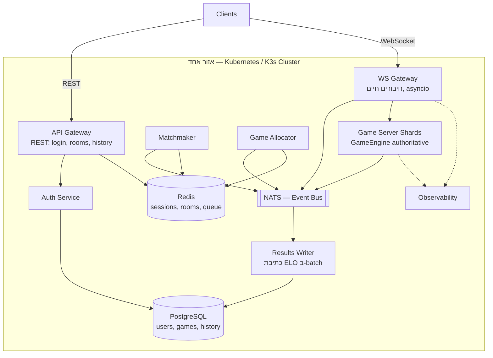

<div dir="rtl">

# Server Design — Kung Fu Chess בקנה מידה גדול

מסמך תכנון לצד השרת, במעבר משרת יחיד (התהליך הנוכחי ב‑`server/`) למערכת
שתומכת ב‑100 מיליון משתמשים רשומים ו‑10 מיליון משחקים במקביל.

המסמך בנוי כך: קודם **מספרים**, מהם נגזרים **רכיבים**, ומהרכיבים נגזרת
**התנהגות בכשל**. כל החלטה כאן נגזרת מהחישוב בסעיף 2 — אם ההנחות משתנות,
המסקנות משתנות איתן.

---

## 1. הנחות

| # | הנחה | ערך |
|---|------|-----|
| 1 | משתמשים רשומים | 100,000,000 |
| 2 | שחקנים פעילים במקביל | 10,000,000 |
| 3 | קצב צעדים לשחקן | צעד כל 2 שניות |
| 4 | אורך משחק | 30–90 שניות (ממוצע: 60) |
| 5 | שחקנים למשחק | 2 (+ צופים בחדרים) |
| 6 | גודל הודעת `move` על החוט | ~200B (\u200F~100B JSON + WS/TCP headers) |

הנחות 1–4 ניתנו בדרישות. 5–6 נגזרות מהפרוטוקול הקיים ב‑`protocol/messages.py`.

---

## 2. חשבון עומס

זה הסעיף שמכתיב את כל השאר.

### 2.1 תעבורת רשת

<div dir="ltr">

```
הודעות נכנסות   = 10,000,000 שחקנים ÷ 2 שניות  = 5,000,000 הודעות/שנייה
רוחב פס נכנס    = 5,000,000 × 200B             ≈ 1 GB/s  ≈ 8 Gbit/s
הודעות יוצאות   = כל צעד משודר ל‑2 שחקנים      = 10,000,000 הודעות/שנייה
רוחב פס יוצא    ≈ 2.5 GB/s                     ≈ 20 Gbit/s
```

</div>

**האם זה הרבה?** לשרת בודד — בלתי אפשרי. לרשת אינטרנט — לא. 20 Gbit/s הוא
סדר גודל של שירות וידאו בינוני, ומתחלק על פני מאות מכונות ומספר אזורים.
המסקנה היא שהבעיה אינה רוחב הפס אלא **מספר החיבורים הפתוחים** ו‑**מספר
ההודעות לשנייה**, ואלה מתחלקים יפה אופקית.

> ⚠️ החישוב לעיל מניח שידור **דלתא** (אירוע הצעד בלבד). המימוש הנוכחי משדר
> את **הלוח המלא** בכל צעד — ראו סעיף 8.1. בשידור לוח מלא (~1KB) המספר
> קופץ פי 5 לפחות, ואם משדרים כל tick (10Hz כמו היום) הוא קופץ פי 50.

### 2.2 קצב משחקים — המספר המפתיע

זה החישוב שהכי משנה את התכנון, והוא לא ברור מאליו:

<div dir="ltr">

```
משחקים במקביל       = 10,000,000 ÷ 2                 = 5,000,000 משחקים
משחקים מסתיימים/שנייה = 5,000,000 ÷ 60 שניות          ≈ 83,000 משחקים/שנייה
בקשות matchmaking/שנייה ≈ 83,000 × 2 שחקנים           ≈ 166,000 בקשות/שנייה
כתיבות ELO/שנייה     = 83,000 × 2 שחקנים              ≈ 166,000 כתיבות/שנייה
```

</div>

**המסקנה:** אורך המשחק הקצר (30–90 שניות) הופך את המערכת ל**מערכת עתירת
כתיבות (write-heavy)**, לא לקריאות. 100 מיליון משתמשים זה נפח אחסון קטן
(סעיף 4.2), אבל 166,000 כתיבות בשנייה זה מעבר למה שמופע PostgreSQL יחיד
עושה. זו הבעיה האמיתית של ה‑DB — לא מספר המשתמשים.

הפתרון: כתיבות ELO **לא** נכתבות מהנתיב החם. הן נזרקות לתור (NATS) ונכתבות
ב‑batch על ידי שירות ייעודי (סעיף 3, `Results Writer`). איגוד של 1,000
עדכונים לטרנזקציה מוריד את הקצב ל‑~170 טרנזקציות/שנייה — מספר שגרתי לחלוטין.

### 2.3 גודל הצי (הערכה)

| רכיב | קיבולת לפוד (הערכה) | פודים דרושים |
|------|---------------------|--------------|
| WS Gateway | ~20,000 חיבורים פתוחים | ~500 |
| Game Server Shard | ~2,000 משחקים מקבילים | ~2,500 |
| Matchmaker | ~10,000 בקשות/שנייה | ~20 |
| API Gateway | לפי קצב לוגינים, לא לפי משחקים | ~50 |

המספרים הם הערכות לצורך סדר גודל ומחייבים אימות ב‑load test (סעיף 3,
`Observability`). הקיבולת לפוד תלויה ישירות ב‑asyncio ובכך שאין thread
לכל לקוח — מודל שהקוד הנוכחי כבר עובד לפיו.

---

## 3. ארכיטקטורה

<div dir="ltr">



</div>

### 3.1 טבלת רכיבים

| רכיב | אחריות | סטייט | סקיילינג |
|------|--------|-------|----------|
| **API Gateway** | כל מה שאינו זמן אמת: login, יצירת/רשימת חדרים, היסטוריה | חסר סטייט | HPA לפי CPU |
| **WS Gateway** | מחזיק את החיבור החי מול הלקוח, מנתב הודעות אל השארד הנכון ובחזרה | מיפוי חיבור→שארד (בזיכרון + Redis) | HPA לפי מספר חיבורים |
| **Auth Service** | אימות סיסמה, הנפקת session token | חסר סטייט | HPA |
| **Matchmaker** | מוצא זוג שחקנים בטווח ELO \u200F±100 | תור ב‑Redis (sorted set לפי ELO) | מחולק לפי מדף ELO ואזור |
| **Game Allocator** | מחליט **על איזה שארד** ירוץ כל משחק | מפת עומס שארדים ב‑Redis | מופעים ספורים, בחירת מנהיג |
| **Game Server Shard** | מריץ את המשחקים עצמם. `GameEngine` הוא ה‑single source of truth | משחקים חיים בזיכרון (ארעי) | הרוב המכריע של הצי |
| **Results Writer** | צורך `game_over` מ‑NATS, מחשב ELO, כותב ב‑batch | חסר סטייט (ה‑offset בתור) | לפי קצב אירועים |
| **Observability** | logs, metrics, traces, health checks, load tests | — | — |

### 3.2 מדוע API Gateway ו‑WS Gateway מופרדים

לא בגלל "נקיון" אלא כי הם נחנקים ממשאבים שונים: REST חסום CPU, בעל שיאי
עומס קצרים וניתן לקישינג; WebSocket הוא חיבורים ארוכי‑חיים החסומים בזיכרון
ובמספר file descriptors. אם שניהם באותו פוד, גל מתחברים מאלץ סקיילינג של
הלוגין, ולהפך.

### 3.3 Game Allocator — למה זה רכיב נפרד

זו התשובה לדרישה "כולם יכולים לשחק עם כולם". לא צריך שכל השחקנים יהיו על
אותו שרת — צריך רק ששני שחקני **אותו משחק** יגיעו לאותו שארד:

1. `Matchmaker` מחליט **מי נגד מי** (או `Rooms API` — מי הצטרף לאיזה חדר).
2. `Game Allocator` מחליט **איפה זה רץ**, לפי עומס, קיבולת וקרבה גאוגרפית.
3. שני ה‑WS Gateways מנתבים את שני החיבורים לאותו שארד.

ההפרדה בין "מי" ל"איפה" היא מה שמאפשר לצי לגדול בלי הגבלה על מי משחק נגד מי.

### 3.4 NATS — ה‑EventBus, רמה אחת למעלה

`kungfu_chess/bus/event_bus.py` הוא publish/subscribe בתוך תהליך אחד. NATS
הוא בדיוק אותו pattern — אותו רעיון של `subscribe(event_type, handler)` —
רק שהמנויים יושבים בקונטיינרים אחרים. זו אותה הפרדה, ברמת קנה מידה אחת
מעלה, ולכן היא לא מצריכה שינוי בתפיסת הקוד הקיים אלא רק בהחלפת המימוש.

---

## 4. בחירת בסיס נתונים

### 4.1 מדוע SQLite לא מתאים

לא מטעמי גודל, אלא משלוש סיבות מבניות:

1. **הוא קובץ, לא שרת.** `server/db.py:14` מחזיק `sqlite3.Connection` יחיד
   **בתוך התהליך**. ברגע שיש יותר מקונטיינר אחד, אין להם דרך לראות את אותו
   קובץ — קונטיינרים לא חולקים מערכת קבצים.
2. **כותב יחיד.** SQLite נועל את כל בסיס הנתונים לכתיבה. מול הדרישה של
   ~166,000 כתיבות/שנייה (סעיף 2.2), זה חוסם מיידית.
3. **אין רפליקציה, failover או שארדינג.** נפילת הדיסק = אובדן כל המשתמשים.

### 4.2 מה במקום — פיצול לפי סוג הדאטה

| דאטה | טכנולוגיה | נימוק |
|------|-----------|-------|
| users, passwords, ELO, תוצאות | **PostgreSQL** (primary + read replicas + pgBouncer) | דורש עמידות ועקביות. 100M שורות × ~200B ≈ **20GB** — נכנס בנוחות למכונה אחת, ולכן **שארדינג לא נדרש** בשלב זה |
| sessions, חדרים פעילים, תור matchmaking, reconnect | **Redis** (Cluster + replicas) | ארעי, נגיש במיליוני פעולות/שנייה, מחיקה אוטומטית ב‑TTL |
| אירועים בין שירותים | **NATS** | pub/sub פנימי, latency נמוך |
| היסטוריית צעדים | **append-only** לתור ומשם ל‑object storage | נפח עצום, לא נקרא בנתיב החם |

ההערה החשובה: 20GB זה **קטן**. האינטואיציה ש"100 מיליון משתמשים ⇐ צריך
שארדינג" שגויה כאן. מה שמחייב תכנון מיוחד הוא קצב הכתיבה, לא הנפח — ולכן
הפתרון הוא `Results Writer` עם batching, לא פיצול הטבלה.

---

## 5. זרימות מרכזיות

### 5.1 Login
`Client → API Gateway (REST) → Auth Service → PostgreSQL` → מוחזר session
token, שנשמר ב‑Redis. ההתחברות ב‑WebSocket מציגה את הטוקן במקום סיסמה.

### 5.2 Play (matchmaking)
1. הלקוח שולח `play` דרך ה‑WS Gateway.
2. `Matchmaker` מכניס אותו ל‑sorted set ב‑Redis לפי ELO ומחפש
   `ZRANGEBYSCORE elo-100 elo+100`. אין התאמה תוך 60 שניות → הודעת כישלון
   (הלוגיקה הקיימת ב‑`server/matchmaking.py`, רק עם מצב משותף).
3. נמצאה התאמה → `Game Allocator` בוחר שארד ומחזיר את כתובתו.
4. שני ה‑WS Gateways מקבלים על NATS את השיבוץ ומחברים את שני הלקוחות לשארד.
5. השארד יוצר `Match` ומתחיל את ה‑tick loop.

### 5.3 Room
`room create` → `Rooms API` מייצר מזהה ורושם אותו ב‑Redis עם TTL. `room join`
→ המזהה נפתר ל‑שארד. השני שמצטרף הוא שחור, הבאים אחריו הם צופים — בדיוק
כמו `server/rooms.py` היום, רק שהרישום ב‑Redis במקום ב‑`dict` בזיכרון.

### 5.4 Move
`Client → WS Gateway → Shard`. השארד מריץ את החוקים דרך `GameEngine`,
ומשדר את התוצאה חזרה לשני השחקנים ולצופים. **ה‑Gateway לא מפרש חוקים —
הוא צינור בלבד.**

### 5.5 Game over
השארד מפרסם `game_over` ל‑NATS → `Results Writer` צובר אירועים → כותב ELO
ותוצאות ל‑PostgreSQL ב‑batch. השארד משחרר את הזיכרון של המשחק.

---

## 6. מיפוי מהקוד הקיים לשירותים

זו הנקודה החשובה: רוב הקוד לא נזרק, אלא **מתפצל** בין שירותים.

| קובץ היום | לאן הוא הולך | שינוי נדרש |
|-----------|--------------|------------|
| `kungfu_chess/**` | Game Server Shard | **ללא שינוי** — זה ה‑authoritative engine |
| `protocol/` | משותף לכל הרכיבים | ללא שינוי |
| `transport/connection.py` | WS Gateway | ללא שינוי מהותי |
| `server/match.py` | Game Server Shard | להסיר קריאות DB מהנתיב החם (8.2) |
| `server/commands.py` | Game Server Shard | ללא שינוי |
| `server/server.py` (lobby) | מתפצל ל‑API Gateway + WS Gateway | פירוק |
| `server/matchmaking.py` | Matchmaker | תור בזיכרון → Redis sorted set |
| `server/rooms.py` | Rooms API + Allocator | `dict` בזיכרון → Redis |
| `server/db.py` | Auth Service | SQLite → PostgreSQL |
| `server/elo.py` | Results Writer | חישוב ללא שינוי, כתיבה ב‑batch |
| `kungfu_chess/bus/event_bus.py` | NATS | אותו pattern, מימוש רשתי |

---

## 7. מטריצת כשלים

| מה נופל | מי מושפע | התאוששות | אובדן |
|---------|----------|-----------|-------|
| **Game Server Shard** | רק המשחקים על אותו שארד | הלקוחות מתחברים מחדש; המשחקים מבוטלים | עד 90 שניות משחק (סעיף 9.1) |
| **WS Gateway** | החיבורים שעליו | הלקוח מתחבר מחדש, ה‑LB מנתב לפוד אחר; ה‑session ב‑Redis שורד | ניתוק קצר; **המשחק עצמו שורד** כי הוא בשארד |
| **API Gateway** | לוגינים וחדרים חדשים | HPA/restart | **משחקים רצים לא מושפעים** |
| **Matchmaker** | מי שממתין לשידוך | כניסה מחדש לתור | המתנה מוארכת |
| **Redis** | תור, חדרים, sessions | Redis Cluster + replicas | במקרה הגרוע: תור מתאפס, שחקנים נכנסים מחדש |
| **PostgreSQL primary** | לוגינים חדשים | failover לרפליקה (~30 שניות) | **משחקים רצים ממשיכים** — עדכוני ELO מצטברים בתור ונכתבים אחרי ההתאוששות |
| **NATS** | תיאום בין שירותים | NATS Cluster | משחקים חדשים לא משובצים עד להתאוששות |

**העיקרון המנחה:** ההפרדה של `Results Writer` מהנתיב החם היא מה שהופך את
השורה של PostgreSQL לנסבלת. במערכת שבה השארד כותב ישירות ל‑DB, נפילת ה‑DB
עוצרת את כל המשחקים; כאן היא רק מעכבת עדכוני דירוג.

---

## 8. חסמי סקייל בקוד הנוכחי

בעיות אמיתיות שזוהו בקוד הקיים, שיחסמו את המעבר לקנה מידה:

### 8.1 שידור הלוח המלא בכל צעד
`server/match.py:151` (`_broadcast_state`) שולח `StateUpdate` עם הלוח המלא
בכל צעד. בקנה מידה זה מכפיל את התעבורה היוצאת פי 5 ומעלה.
**תיקון:** לשדר אירוע/דלתא; הלקוח מסמלץ מקומית לצורך רינדור (סעיף 10.2).

### 8.2 שתי קריאות DB בכל שידור
`server/match.py:164` קורא `db.get_elo` פעמיים בכל בניית `StateUpdate`.
ב‑5 מיליון צעדים/שנייה זה 10 מיליון קריאות DB/שנייה.
**תיקון:** ה‑ELO אינו משתנה תוך כדי משחק — לקרוא פעם אחת בעת יצירת ה‑`Match`
ולשמור בזיכרון.

### 8.3 חיבור SQLite משותף בתוך התהליך
`server/db.py:14` — ראו 4.1.

### 8.4 סטייט בזיכרון התהליך
`RoomManager._rooms` (\u200F`server/rooms.py:46`) ותור ה‑`Matchmaker` הם מבני
נתונים מקומיים. הם חייבים לעבור ל‑Redis כדי ששני מופעים יראו את אותו מצב.

### 8.5 אין reconnect
`Match` חי רק בזיכרון של התהליך, ולכן לקוח שהתנתק לא יכול לחזור למשחק —
רק ספירת ה‑20 שניות ל‑auto-resign (`server/match.py:113`) פועלת. עם רישום
`user → shard` ב‑Redis, אותו חלון של 20 שניות הופך לחלון reconnect אמיתי.

---

## 9. פריסה: Docker, Kubernetes, K3s

- **Docker** — כל שירות נארז לאימג' משלו. תהליך אחד לקונטיינר.
- **Kubernetes** — מנהל את הצי: Deployment לכל שירות, HPA לסקיילינג
  אוטומטי, liveness/readiness probes, PodDisruptionBudget, פריסה
  מולטי‑AZ, rolling updates.
- **K3s** — הפצת Kubernetes קלה (בינארי יחיד). אותו API, מתאים לפיתוח
  מקומי ולצמתים קטנים. שימושי כדי לבדוק את המניפסטים בלי קלאסטר ענן.
- **Agones** (אופציונלי) — הרחבה של Kubernetes לשרתי משחק. הבעיה שהיא
  פותרת: k8s מניח שכל פוד ניתן להחלפה ולהריגה, אבל שארד עם משחק חי עליו
  לא. Agones מוסיף מצבי `Ready`/`Allocated` כדי שה‑autoscaler לא יקטול פוד
  שיש עליו משחק פעיל.

### 9.1 מדוע אורך משחק של 30–90 שניות מפשט הכול

זו התובנה התפעולית המרכזית. המשחקים **קצרים וחד‑פעמיים**, ולכן:

- **אין צורך לשמר סטייט משחק לדיסק.** הוא חי בזיכרון ומת עם המשחק.
- **נפילת שארד היא אירוע קטן** — מפסידים לכל היותר 90 שניות של משחקים.
- **Rolling upgrade הוא טריוויאלי**: "הפסק לקבל משחקים חדשים → חכה 90
  שניות → הרוג את הפוד". אף שחקן לא נפגע. זהו בדיוק ה‑`Allocated` של Agones.
- **Autoscaling יכול להיות אגרסיבי** — הצי מתרוקן מעצמו תוך דקה.

במילים אחרות, `Game Server Shard` הוא stateful מבחינת נתונים אבל **כמעט
stateless מבחינה תפעולית**, וזה מה שמאפשר להריץ אלפי מופעים שלו בנוחות.

---

## 10. החלטות פתוחות

### 10.1 Matchmaking חוצה אזורים
הארכיטקטורה בסעיף 3 היא של **אזור אחד**, והמערך משוכפל לאזורים נוספים.
מכאן שהשידוך הוא אזורי, ו"כולם משחקים עם כולם" נכון בתוך אזור בלבד.
**החלטה:** לקבל את זה במודע — משחק בזמן אמת עם 250ms latency בין יבשות
אינו שחיק. הרחבה אפשרית בהמשך: שכבת matchmaking גלובלית לשחקנים
שממתינים מעל סף זמן מסוים.

### 10.2 שרת authoritative מול סימולציה בלקוח
סעיף 8.1 דורש שידור דלתאות במקום סטייט מלא, מה שמחייב את הלקוח לסמלץ
מקומית בין עדכונים. זה **אינו** סותר את "ה‑GameEngine הוא ה‑single source
of truth": הלקוח מסמלץ **לצורך רינדור בלבד**; השרת מכריע; במקרה של סתירה
השרת מנצח והלקוח מתקן את עצמו.

### 10.3 מה קורה למשחק כששארד נופל
שתי אפשרויות: (א) לבטל את המשחק ולא לעדכן ELO, (ב) לשכפל את סטייט המשחק
לשארד גיבוי. **הבחירה: (א)** — שכפול מכפיל את עלות הצי כדי להגן על 90
שניות של משחק. עלות/תועלת לא מצדיקה זאת בשלב זה.

---

## 11. הפרוסה המינימלית — Docker Compose

לא מממשים את כל הרכיבים. המטרה היא להוכיח את הרעיון המרכזי — **ששני
שחקנים מגיעים לאותו שארד דרך החלטת שיבוץ, ושהשארד השני מריץ משחק אחר
במקביל**. שני שארדים מוכיחים את זה; חמישה לא מוסיפים דבר.

| שירות ב‑Compose | תפקיד |
|-----------------|-------|
| `postgres` | משתמשים + ELO (מחליף את SQLite) |
| `redis` | תור matchmaking, רישום חדרים, מיפוי `user → shard` |
| `gateway` | WS Gateway + לוגין; מנתב לשארד |
| `allocator` | בחירת שארד (round-robin או "הכי פחות עמוס") |
| `shard-1`, `shard-2` | שני מופעים של שרת המשחק |

מה שזה מדגים: DB חיצוני משותף, סטייט משותף ב‑Redis, החלטת שיבוץ נפרדת
מהשידוך, וריצה של שני שארדים במקביל. מה שזה **לא** מדגים ונשאר לתכנון
בלבד: NATS, Agones, מולטי‑אזור, ו‑autoscaling.

</div>
